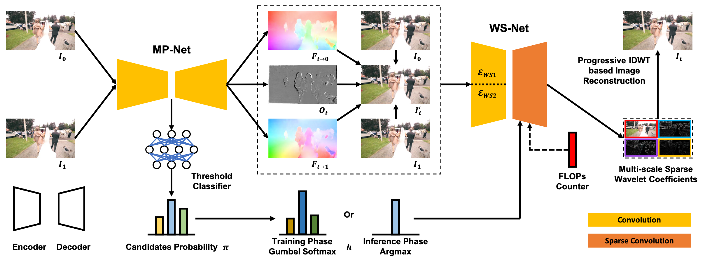

# Dynamic Frame Interpolation in Wavelet Domain
The official PyTorch implementation of [WaveletVFI](https://arxiv.org/abs/2309.03508) (TIP 2023).

Authors: [Lingtong Kong](https://scholar.google.com.hk/citations?user=KKzKc_8AAAAJ&hl=zh-CN), [Boyuan Jiang](https://byjiang.com/), Donghao Luo, Wenqing Chu, [Ying Tai](https://tyshiwo.github.io/), Chengjie Wang, [Jie Yang](http://www.pami.sjtu.edu.cn/jieyang)

## Abstract
Video frame interpolation is an important low-level vision task, which can increase frame rate for more fluent visual experience. Existing methods have achieved great success by employing advanced motion models and synthesis networks. However, the spatial redundancy when synthesizing the target frame has not been fully explored, that can result in lots of inefficient computation. On the other hand, the computation compression degree in frame interpolation is highly dependent on both texture distribution and scene motion, which demands to understand the spatial-temporal information of each input frame pair for a better compression degree selection. In this work, we propose a novel two-stage frame interpolation framework termed WaveletVFI to address above problems. It first estimates intermediate optical flow with a lightweight motion perception network, and then a wavelet synthesis network uses flow aligned context features to predict multi-scale wavelet coefficients with sparse convolution for efficient target frame reconstruction, where the sparse valid masks that control computation in each scale are determined by a crucial threshold ratio. Instead of setting a fixed value like previous methods, we find that embedding a classifier in the motion perception network to learn a dynamic threshold for each sample can achieve more computation reduction with almost no loss of accuracy. On the common high resolution and animation frame interpolation benchmarks, proposed WaveletVFI can reduce computation up to 40% while maintaining similar accuracy, making it perform more efficiently against other state-of-the-arts.

## Framework
Overall framework of our WaveletVFI that can interpolate frames dynamically in wavelet domain.

## Preparation
1. We have verified that this repository supports Python 3.6/3.7, PyTorch 1.9.1/1.10.1.
2. <code>$ cd pytorch_wavelets && python setup.py install</code>
3. <code>$ pip install onnx imageio</code>
4. Download training and test datasets: [Vimeo90K](http://toflow.csail.mit.edu/)
5. Set the right dataset path on your machine.

## Evaluation

1. Download our pre-trained models in this [link](https://www.dropbox.com/scl/fo/6cyqswzyfjggxtbkc3qfs/h?rlkey=dx33nimhpkw81n39uvqud1d2s&dl=0), and then put file <code> checkpoints</code> into the root dir.

2. Run the following scripts to evaluate on Vimeo90K test dataset.
<pre><code>$ python benchmark/Vimeo90K.py</code></pre>

## Training
1. Stage1, pre-train WaveletVFI on Vimeo90K training dataset statically
<pre><code>$ python -m torch.distributed.launch --nproc_per_node=4 train_vimeo90k.py --world_size 4 --epochs 300 --batch_size 6 --lr_start 1e-4 --lr_end 1e-5</code></pre>

2. Stage2, load pre-trained WaveletVFI in Stage1 and train WaveletVFI on Vimeo90K training dataset dynamically
<pre><code>$ python -m torch.distributed.launch --nproc_per_node=4 train_vimeo90k.py --world_size 4 --epochs 100 --batch_size 6 --lr_start 1e-4 --lr_end 1e-5 --dynamic 'true'</code></pre>
